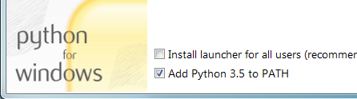
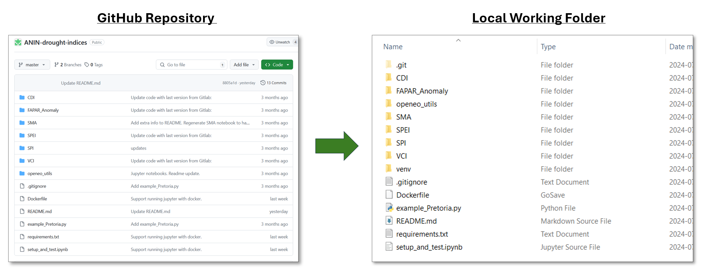

# Installation

## Requirements
To run the Drought Indices tools, a recent version of Python needs to be installed on your system—first, visit [Python.org](https://www.python.org/){:target="_blank"} to confirm the latest version number. 

You can check the version of Python you have installed by pressing `Win + R`, type `cmd`, and press `Enter` to open Command Prompt then running the command below. 
```
python --version
```
Please ensure that version 3.8 or higher is installed before proceeding. 

## Installing Python
Install Python by downloading an installer appropriate to your system from [python.org](https://www.python.org/){:target="_blank"}  and running it.

!!! Note ""

    Be sure to check the box to have Python added to your PATH.

    

## Installing Git on Windows
1. Navigate to the latest [Git for Windows installer ](https://gitforwindows.org/){:target="_blank"} and download the latest version.
2. Follow the instructions as provided in the Git Setup wizard screen until the installation is complete. When prompted, select use standard Git Windows Command Prompt.
3. Verify that Git was properly installed by running the following in `Command Prompt`.
   
```
 git version
``` 

!!! tip "Other Operating Systems"
    If you are running other operating systems such as macOS, Linux, Ubuntu, etc, please follow the installation steps:

    For Python visit: [Download Python for Other Platforms ](https://wiki.python.org/moin/BeginnersGuide/Download){:target="_blank"}

    For Git visit: [Install Git for Other Platforms](https://github.com/git-guides/install-git){:target="_blank"}

## Clone the ANIN drought indices repository
Open a Command Prompt or a terminal and change the directory to the folder where you will be working. As an example, if you are working from a drive labelled `*K*` in the folder located at this directory address `K:\DroughtIndices`, the following prompt will change the directory.

```
k:
```
```
cd k:\DroughtIndices
```

Now that you are in your working folder, you can clone the ANIN drought indices repository using the following prompt:
```
git clone https://github.com/VitoTAP/ANIN-drought-indices
```
All the files in the ANIN Drought Indices repository will be cloned to your local machine in your specified working folder. You can easily verify that in Windows Explorer. 

!!! Note ""
    

In Command Prompt, change the directory again to point to the newly created `ANIN-drought-indices` folder on your PC using the following prompt:
``` 
cd \ANIN-drought-indices
```
## Create a Virtual Environment with Python
Users with software dependent on older Python versions, like ArcGIS, may encounter issues in Command Prompt. To avoid conflicts when running ANIN tools, create a virtual environment in your working folder by executing the following commands:

``` 
python -m venv venv
```
!!! Tip
    If you encounter an error when creating the virtual environment, Command Prompt might be calling an older version of Python. To fix this, modify the command to point to the latest version by replacing `python` with the full path to the `python.exe` file from your recent installation. It should look like this:
    ```
    path/to/where/python/is/installed/python.exe -m venv venv
    ```
    To find the location of the latest Python follow these [steps](FAQ_Python.md#how-do-i-find-the-location-of-my-python-installation)

Once the virtual environment is created, we can activate it.
``` 
venv\Scripts\activate.bat
```
!!! Note
    You will need to activate the virtual environment each time you restart a session in Command Prompt. When the virtual environment is activated, you will see (venv) in front of the directory.

## Install pip and other requirements
We can now install pip and the other requirements to run the ANIN drought indices tools.

```
python -m pip install -r requirements.txt
```
Now that all the installations are complete, we can start running the different drought indices tools.
