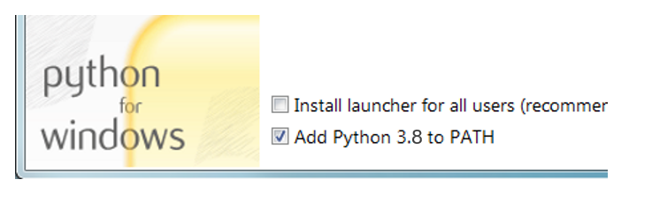

# Installation

## Requirements
A recent version of Python and the Python package manager, pip, needs to be installed on your system

You can check if you already have them installed by running the following command
```bash
python --version
```
```bash
pip --version
```
To run the ANIN drought indicies code, you will also require a Jupyter Notebook account. If you already have the latest version of Python and pip installed, and you have a Jupyter Notebook account, you can skip to Accessing the source code
## Installing Python
Install Python by downloading an installer appropriate to your system from [python.org](https://www.python.org/)  and running it.

!!! Note

    Be sure to check the box to have Python  added to your PATH.

    


## Installing pip
If you have the latest version of Python installed on your system, then pip will likely be installed by default. Should you require to upgrade pip to the latest version, you can use the following code in command prompt:
```bash
pip install --upgrade pip
```
If you need to install pip for the first time, download [get-pip.py](https://bootstrap.pypa.io/get-pip.py.). Open a terminal/commnad prompt, `cd` to the folder containing the `get-pip.py` file and run:
``` bash
py get-pip.py
```
## Set up Jupyter Lab account
The ANIN drought indicies code can be run easily from Jupiter Notebooks. To setup an account do the following:
1. Go to the [openEO Platform](https://openeo.cloud/), and scroll down to `CLIENTS`
2. Click on `OPEN JUPYTERLAB`, which will take you to the egi landing page. You can easily create an accout using Linkedin or any of the other options provided.
3. Once logged in, start `openEO Platform Lab`.

## Accessing the source code
Source code for the drought indices used in the ANIN project can be installed directly from the project repository:

```bash
pip install git+https://github.com/PEOPLE-ER/Spectral-Recovery.git#egg=spectral_recovery
```