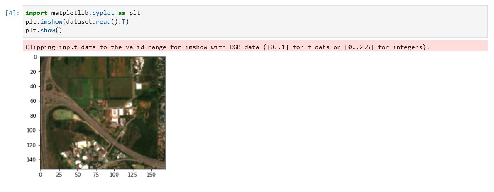
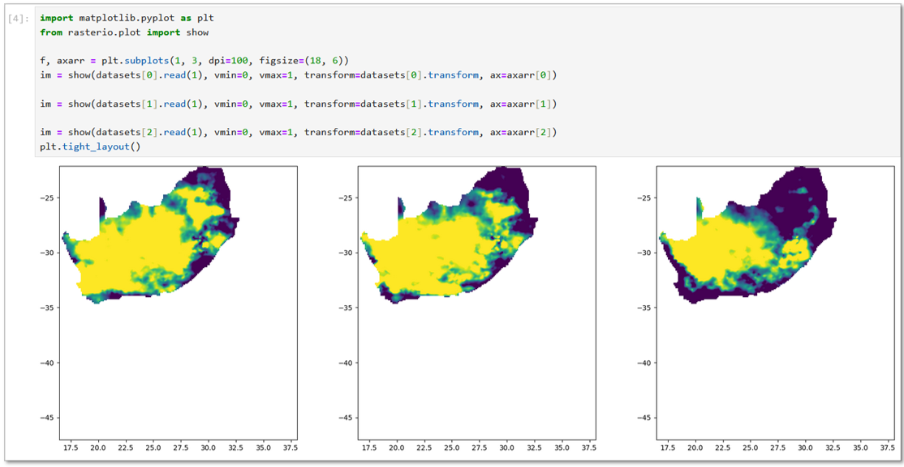

# Running Drought Indices from Jupyter Notebooks

Here is a simple workflow using examples, locations and dates that will aid you in accessing the ANIN drought indices through Jupyter Notebook. After completing the steps below, you should be able to adjust the location with your coordinates and date ranges where applicable.

The steps described below should be completed after the initial Installation.

## Install Jupyterlab and Notebook
Use the following Python prompts to install Jupyterlab and Notebook.
``` py
pip install jupyterlab
```
``` py
pip install notebook
```
## Launch Jupyter Notebook
1. Open Windows Explorer and navigate to the folder where the **ANIN-drought-indices** folder is cloned.
2.  Click on the **Address bar** and copy the address.
3.  Type **CMD** in the address bar and hit **Enter**. This will launch the Command Prompt.
4.  In the Command Prompt window, enter the following code:
``` py
jupyter notebook
```
This will open Jupyter Notebook in your default browser.
!!! note ""
    

## Setup and Testing
Double-click `setup_and_test.ipynb` on the home page. It will open in a new tab and require you to 'Restart the kernel and run all cells (under `Run` in the menu).
Jupyter Notebook will install all the requirements to run the code, followed by a sample test query, which requests a Sentinel-2 image over The Innovation Hub in Pretoria, South Africa.

!!! note ""
      
    

## Edit the spatial and temporal extent

Within the code block, you can change the location to that of your choosing and adjust the date range for the image search and the name of the output file by changing the values in the highlighted lines shown below.

``` py hl_lines="7 8 9 10 11 18 23"
import openeo
from openeo.processes import process

url = "https://openeo.cloud"
connection = openeo.connect(url).authenticate_oidc()

spatial_extent_sansa = {
    "east": 28.275,
    "north": -25.740,
    "south": -25.755,
    "west": 28.260,
}

datacube = connection.load_collection(
    collection_id="SENTINEL2_L2A",
    bands=["B04", "B03", "B02"],
    spatial_extent=spatial_extent_sansa,
    temporal_extent=["2024-03-05", "2024-03-07"],
)
# Scale values for better visualisation
datacube = datacube / 2500

datacube.download("out-Pretoria.tiff")
```

## Run Standardised Precipitation Index (SPI)
In the SPI folder, you will find `SPI_openeo.ipynb`. Double-click on it to open it in a new tab. This index will return results for the whole country with results previews provided.
!!! note ""
       

The code block provides you the option to adjust the temporal extent by adjusting the highlighted line of code:

```py hl_lines="2"
dc = SPI_dc
dc = dc.filter_temporal(["2022-01-01", "2022-06-01"])
# out_format = "NetCDF"
out_format = "GTiff"
dc = dc.save_result(format=out_format)
output_path = custom_execute_batch(dc, job_options=heavy_job_options, out_format=out_format)
```
## Run Soil Moisture Anomaly (SMA)
From the Jupyter Home page, open the SMA folder and double-click `SMA_openeo.ipynb` to open the notebook. It will open in another tab. As will the startup, **Restart the kernel and run all cells**. Should you encounter a request to authenticate your account, follow the link to the EGI login website and log in. 
Return to the SMA notebook to view the results.

!!! tip
    The script will create the output TIFFs in folders labelled `out-xxx` in the respective folders, which can be visualised in any GIS software.

