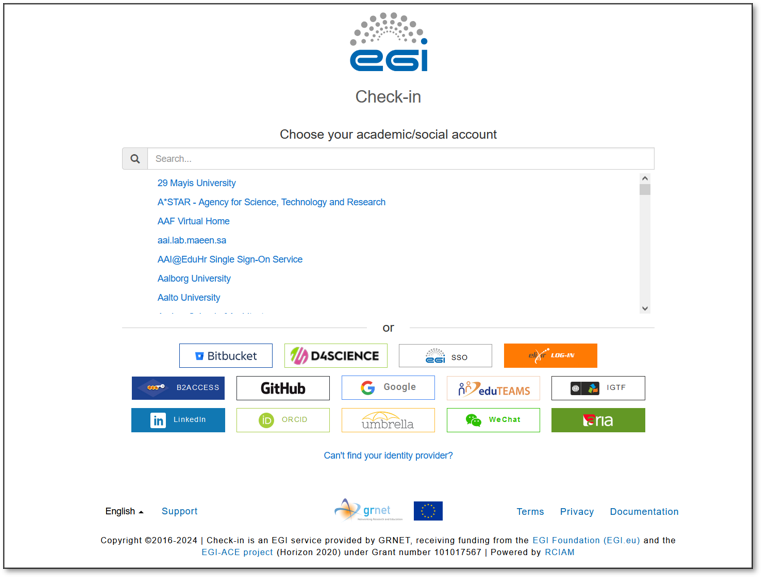
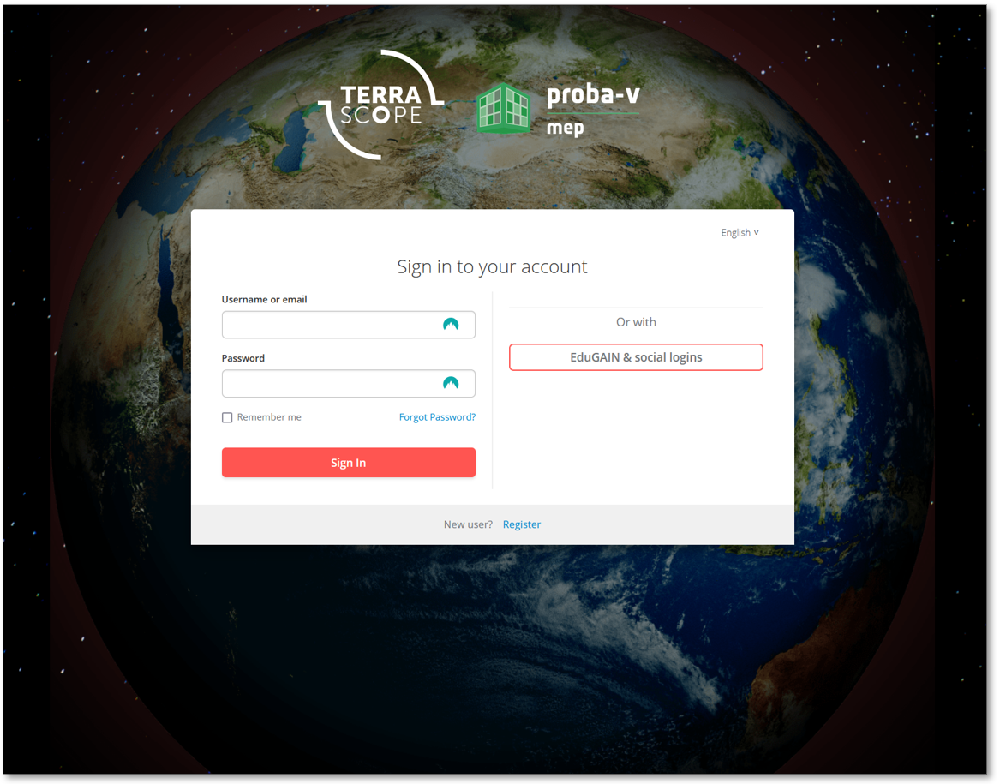

# Frequently Asked Questions (FAQ)

## **Where/How do I create an OpenEO account?**
To run the ANIN drought indices algorithms, you'll need access to the OpenEO cloud platform. Follow these steps to create an account:

**Visit the EGI Check-in Page:** Start by navigating to the [EGI Check-in page](https://aai.egi.eu/proxy/module.php/discopower/disco.php?entityID=https%3A%2F%2Faai.egi.eu%2Fproxy%2Fmodule.php%2Fsaml%2Fsp%2Fmetadata.php%2Fsso&return=https%3A%2F%2Faai.egi.eu%2Fproxy%2Fmodule.php%2Fsaml%2Fsp%2Fdiscoresp.php%3FAuthID%3D_7a473b37c54294d9f36d3c56eac2c7177107c144ae%253Ahttps%253A%252F%252Faai.egi.eu%252Fproxy%252Fsaml2%252Fidp%252FSSOService.php%253Fspentityid%253Dhttps%25253A%25252F%25252Faai.egi.eu%25252Fauth%25252Frealms%25252Fegi%2526RelayState%253Dgtb2tid-wn-cWT6RB_e2emwtVuddoOLY_id5j09NYfw.nzNGxcB_d0k.rfo5U0QgS1Sx0daO_T2H1g%2526cookieTime%253D1726035199&returnIDParam=idpentityid){:target="_blank"}. 

!!! Note ""
    

**Sign Up:** On the EGI Check-in page, you can sign up using your social accounts such as **Google**, **LinkedIn**, or **GitHub**. Choose your preferred social account and follow the on-screen instructions to set up your account.

**Register with Work Email:** If you prefer to use your work email, click on the **Can't find your identity provider?** link at the bottom of the page. Follow the instructions to create an EGI SSO account. You’ll receive an email with instructions to complete the setup.

**Log In to Terrascope Portal:** After setting up your account, go to the [Terrascope portal](https://portal.terrascope.be/auth/login){:target="_blank"} and `SIGN IN` using `EduGAIN & social logins` with the credentials you created.

!!! Note ""
        

**Grant Access:** When prompted, click `Yes` to grant access to Terrascope. Complete the required information on the intake form to finalize your registration.

## **I'm having trouble setting up my account. What should I do?**
If you encounter any issues while setting up your account, please email ^^checkin-support@mailman.egi.eu^^ for further assistance. 

