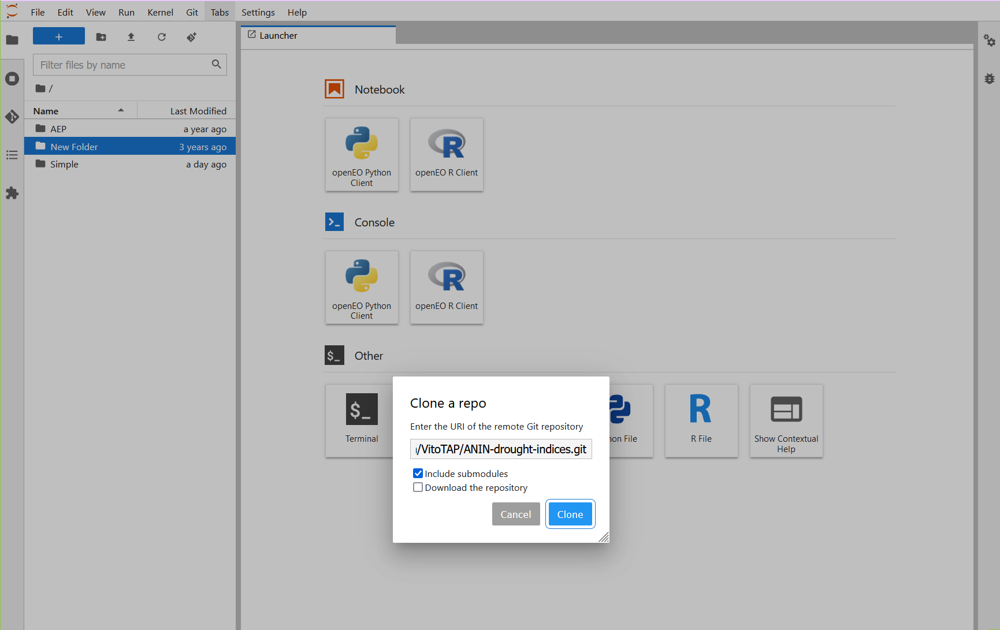

# Quick Overview
Here is a simple workflow using examples locations and dates, that will aid you to access the ANIN drought indicies through Jupyter Notebook. After completing the steps below, you should be able to adjust the location with your own coordinates and date ranges where applicable.

### Clone the repository into Jupyter Notebook

Begin by importing the ANIN-drought-indices into Jupyter Notebook using the `Git Clone` button.

!!! tip ""
      
    

A folder containing the ANIN-drought-indices will be created. 

### Setup and Testing

Open it and double click `setup_and_test.ipynb`. It will open in a new tab and require you to 'Restart the kernal and run all cells`.
Jupyter Notebook will install all the requirements to run the code followed by a sample test query, which requests a Sentinel-2 image over The Innovation Hub in Pretoria, South Africa.

!!! tip ""
      
    

