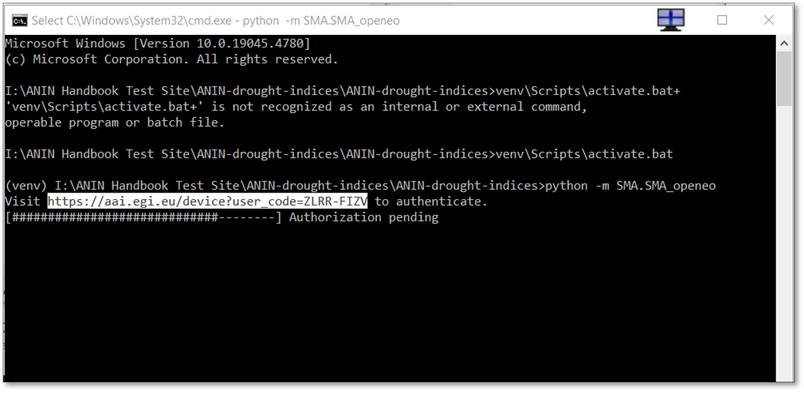
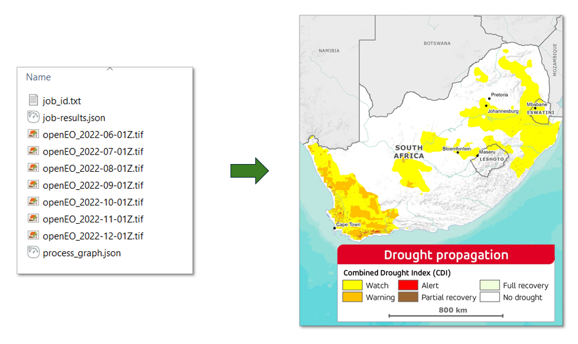

## General Overview
All the tools developed in this project can be deployed and executed using Command Prompt, Jupyter Notebooks, or Docker. This section of the Handbook follows the previous section and presents a simple workflow for computing the drought indices from Command Prompt. For a more detailed explanation of each index, it's use and application, see the [Specifications](theoretical_basis.md). 

!!! Warning "Before your proceed"
    1. Make sure have created and activated the [Python Virtual Environment](Installation.md#create-a-virtual-environment-with-python).
    2. Make sure you have an active [OpenEO account](OpenEO.md).

The table below shows the drought indices and their corresponding Python prompt.  Please note that with CDI you must define a temporal extent.

| Index         | Command                                    | Requirements    | 
| :------------ | :---------------------------------------------- | :---------------|
| Soil Moisture Anomaly (SMA)           | `python -m SMA.SMA_openeo`                      | None            |
| Standardised Precipitation Index (SPI)          | `python -m SPI.SPI_openeo`                      | None            |
| Standardised Precipitation-Evapotranspiration Index (SPEI)         | `python -m SPEI.SPEI_openeo`                    | None            |
| FAPAR Anomaly | `python -m FAPAR_Anomaly.FAPAR_Anomaly_openeo`  | None            |
| Vegetation Condition Index (VCI)         | `python -m VCI.VCI_openeo`                      | None            |
| Combined Drought Indicator (CDI)         | `python -m CDI.CDI_openeo`                      | Temporal extent |

## Example 1: Standardised Precipitation Index (SPI)
The SPI tool provides monthly time-series information based on precipitation data. It is computed at a national scale at a resolution of 1° x 1° and requires no temporal extent as an input. To run SPI, input the Python code below into the command prompt.
``` py
python -m SPI.SPI_openeo
```
The script will create the output TIFFs in folders labelled `out-xxx` in the SPI folder, which can be visualised in any GIS software.
!!! note ""
    

!!! warning "Authentification Error"
    The first time you run the command, you may be prompted to authenticate via the EGI website.

     
     Simply copy the provided URL (CTRL +M) as seen above, paste it into your browser, and follow the authentication steps using your OpenEO account credentials. When prompted select `Yes` to `Grant Access to openEO Platform`

## Example 2: Combined Drought Indicator (CDI)
The CDI tool provides near-monthly time-series information based on Standardised Precipitation Index (SPI), Soil Moisture Anomaly (SMA) and FAPAR anomaly, resulting in maps that can be used for drought watch, warning and alert. This tool does require a temporal extent for performance. To run CDI, input the Python code below into the command prompt. In this example, we use June to December 2022 as our temporal extent.
``` py
python -m CDI.CDI_openeo "2022-06-01" "2022-12-01"
```
As with Example 1, an `out-xxx` folder will be created in the CDI folder, which contains six TIFFs, as shown below. These can be visualised in any GIS software.
!!! note ""
       

## Export to CSV format
The default output format for the Drought Indices Python code is TIFF. If you prefer to receive the output in CSV format, simply append the `--out_format=CSV` option to the end of any command listed in the table above. For example, you would use the following command to get SMA in CSV format. 
``` py
python -m SMA.SMA_openeo --out_format=CSV
```
!!! note
    The CSV output contains data aggregated as an average at the secondary catchment level.