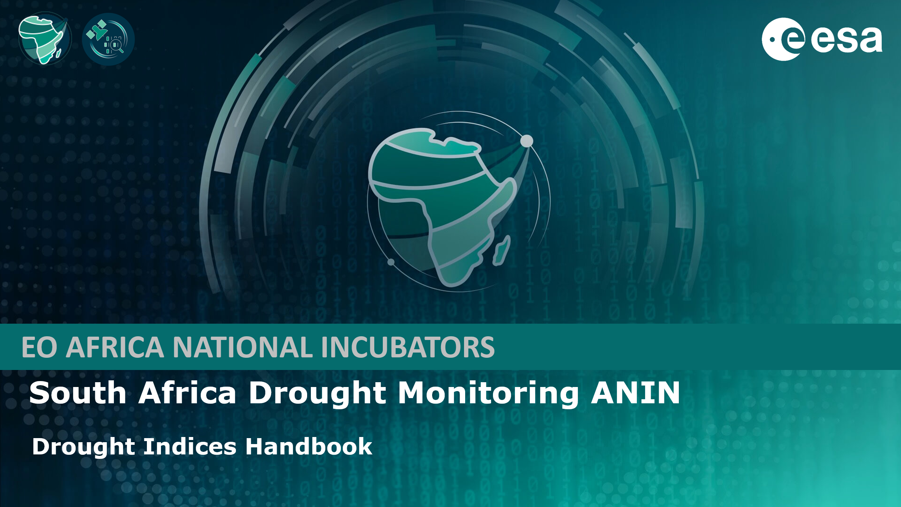
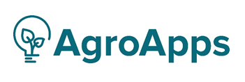
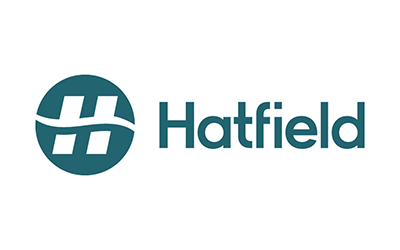

# ANIN Drought Indices Handbook

## Introduction

Welcome to the handbook for the ANIN South Africa Drought Monitoring Project. This project is part of the EO Africa initiative, funded by the European Space Agency (ESA), aimed at enhancing the capacity of South African stakeholders to manage drought risks through advanced Earth Observation (EO) technologies. The primary objective of this project is to develop and implement innovative drought indices tools that provide timely and accurate information to support decision-making processes.

## Objectives
1. 
**Enhance Drought Monitoring:** Develop robust drought indices that utilize EO data to provide real-time monitoring and assessment of drought conditions.
2. 
**Support Decision-Making:** Equip stakeholders with reliable tools and information to make informed decisions regarding drought management and response.
3. 
**Capacity Building:** Train local authorities and organizations in the use of EO-based drought indices tools, fostering self-reliance and sustainability.
4. 
**Promote Collaboration:** Facilitate partnerships between African institutions, international organizations, and the scientific community to advance drought resilience efforts.

## Acknowledgements
The tools presented in this handbook where created as a result of a collaborative effort by the members of a consortium who's members include:

- 
- 
- 
- 

For more information on the ANIN South Africa Drought Monitoring Project visit [https://eoafrica.drought-za.org/](https://eoafrica.drought-za.org/).

