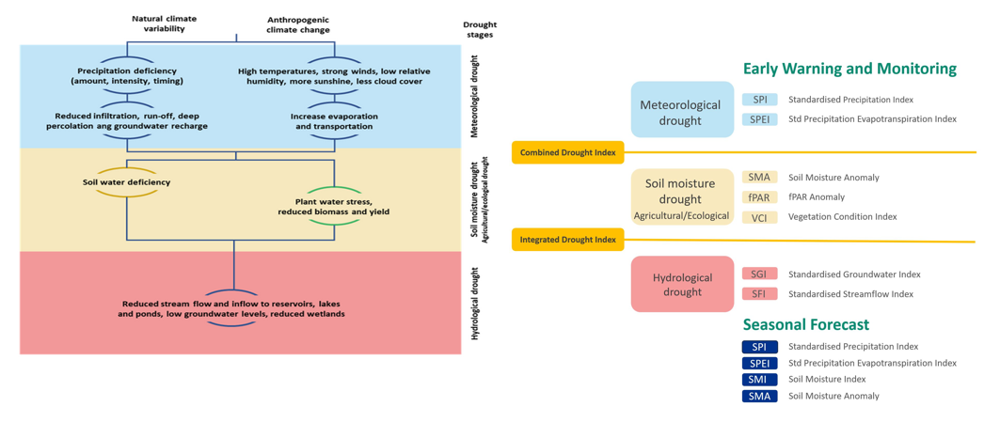
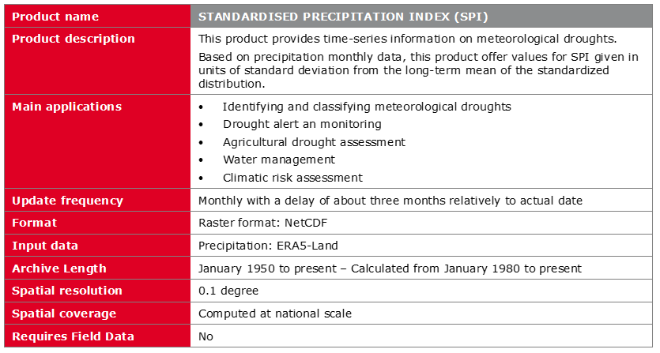
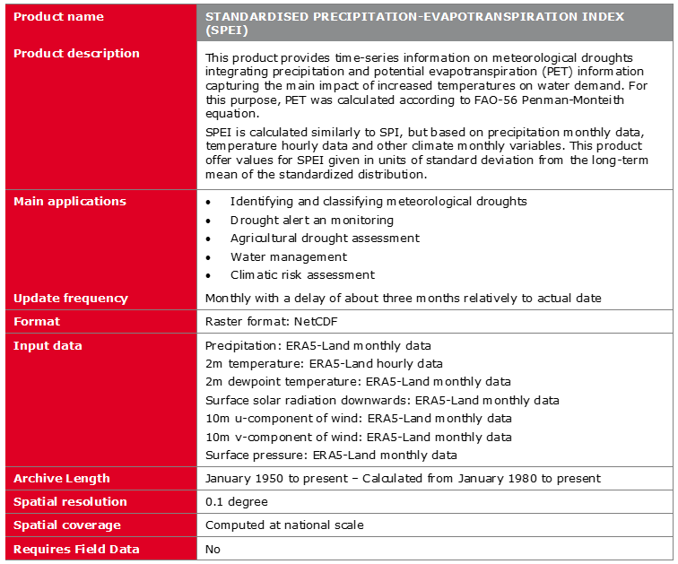

### Summary
Drought is a common climate feature caused by prolonged low precipitation, poor rainfall timing, or increased water loss due to high temperatures.Monitoring droughts involves analyzing various indicators and indices that reflect different parts of the hydrological cycle, such as precipitation, soil moisture, and water levels. These indicators show statistical anomalies compared to long-term climate data, indicating the severity of a drought.

There are three main methods for monitoring droughts:

1. Single indicator or index.
2. Multiple indicators or indices.
3. Composite or hybrid indicators.

In the implementation of the ANIN project and through consultation with the South African partners, the following indicies and indictors where developed for drought early warning, monitoring and forcasting for South Africa. 
!!! note ""
     

The following sections describe the drought indices presented in this Handbook, and their key characteristics. For more information detailed information, please refer to the [ATBD and products specification document](https://eoafrica.drought-za.org/sites/default/files/downloads/GMV-ANIN-D8-ATBD-Algorithm%20Theoretical%20Basis%20Document_v1.pdf) of the ANIN project

## Standardised Precipitation Index (SPI)
SPI was developed to quantify precipitation deficits, over various timescales, ranging from 1 to 36 months. This flexibility allows it to reflect short-term soil moisture conditions as well as long-term groundwater and reservoir storage levels.

## Standardised Precipitation-Evapotranspiration Index (SPEI)
SPEI extends the capabilities for SPI by incorporating both precipitation and potential evapotranspiration (PET). This inclusion allows the SPEI to account for the effects of temperature on drought conditions. SPEI is able to reflect the impact of increased temperatures on water demand, which is crucial for understanding drought severity under changing climate conditions. The SPEI can be calculated over various timescales, from 1 to 48 months, allowing it to capture both short-term and long-term drought conditions.

## Vegetation Condition Index (VCI)
